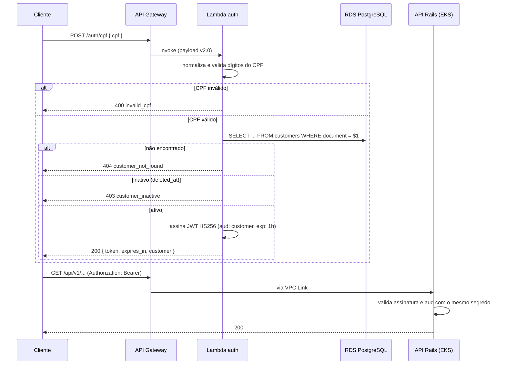

# auto-repair-auth-lambda

Função serverless de autenticação por CPF do sistema de gestão de oficina
mecânica (Tech Challenge — Fase 3, FIAP postech).

**Terceiro** repositório na ordem de aplicação: depende da VPC e do API Gateway
de [`auto-repair-infra-k8s`](https://github.com/IgorSantosXP/auto-repair-infra-k8s)
e do banco de [`auto-repair-infra-database`](https://github.com/IgorSantosXP/auto-repair-infra-database).

## Propósito

Recebe um CPF, valida, confirma que existe um cliente ativo com aquele documento
e devolve um JWT de curta duração para consumo das rotas protegidas da API.



## Contrato

### `POST /auth/cpf`

```json
{ "cpf": "111.444.777-35" }
```

Pontuação é opcional — o CPF é normalizado para apenas dígitos antes da consulta,
que é o formato em que a aplicação persiste o campo `document`.

**200 OK**

```json
{
  "token": "eyJhbGciOiJIUzI1NiIsInR5cCI6IkpXVCJ9...",
  "token_type": "Bearer",
  "expires_in": 3600,
  "customer": { "id": 42, "name": "Maria Souza" }
}
```

**Erros**

| HTTP | `code` | Quando |
|---|---|---|
| 400 | `invalid_request` | Corpo não é JSON válido |
| 400 | `invalid_cpf` | CPF ausente, com tamanho errado ou dígitos verificadores inválidos |
| 404 | `customer_not_found` | Nenhum cliente com aquele documento |
| 403 | `customer_inactive` | Cliente removido logicamente (`deleted_at`) |
| 503 | `database_unavailable` | Falha ao alcançar o RDS |

O formato de erro é o mesmo da API Rails (`{ "error": { "code", "message" } }`),
para que o consumidor não precise tratar dois contratos.

## Token emitido

```json
{
  "sub": "42",
  "name": "Maria Souza",
  "document": "11144477735",
  "aud": "customer",
  "iss": "auto-repair-auth",
  "exp": 1757980800
}
```

Assinado em **HS256** com o segredo guardado no Secrets Manager
(`auto-repair/app`), o mesmo que a API Rails usa para validar. O claim `aud`
separa o token de cliente (emitido aqui) do token de administrador (emitido pelo
`POST /api/v1/auth/login` da aplicação), e a API autoriza cada rota pelo público
esperado.

> **Limitação conhecida, e deliberada.** CPF é identificador público, não
> credencial: qualquer um que conheça o CPF de um cliente obtém um token. É o que
> o enunciado da fase especifica. As mitigações adotadas estão registradas no
> [RFC 0003](https://github.com/IgorSantosXP/auto-repair-api/blob/main/docs/rfc/0003-estrategia-de-autenticacao.md):
> expiração de 1 hora, escopo restrito ao próprio cliente e throttling no API Gateway.

## Tecnologias

Node.js 22 (ESM), `pg`, `jsonwebtoken`, `node:test` para os testes,
Terraform 1.10+, AWS Lambda, API Gateway v2, Secrets Manager.

## Estrutura

```
src/          código da função (index, validação de CPF, logger estruturado)
test/         testes com o runner nativo do Node
infra/        Terraform da função, da role, do SG e da rota no API Gateway
```

## Execução local

```bash
npm install
npm test        # 9 testes, sem dependência de rede ou banco
npm run build   # gera dist/ com as dependências de produção
```

A função não roda de ponta a ponta fora da AWS, porque precisa do RDS em subnet
privada. Os testes cobrem validação de CPF e os caminhos de erro anteriores à
consulta no banco.

## Deploy

```bash
make init
make plan
make up
```

O Terraform executa `npm run build` automaticamente quando o código muda
(`null_resource` com hash dos fontes) e empacota `dist/` no zip da função.

Testando depois de aplicado:

```bash
make invoke CPF=11144477735
make logs
```

Para remover:

```bash
make down
```

> **Custo.** A Lambda cabe no free tier permanente (1M de invocações/mês). Os
> únicos custos são as ENIs na VPC e os logs no CloudWatch, ambos desprezíveis.

## Rede

A função roda **dentro da VPC**, nas subnets privadas, para alcançar o RDS. Essas
subnets não têm NAT Gateway, ou seja, a função não tem saída para a internet —
por isso as credenciais e o segredo JWT são lidos do Secrets Manager em tempo de
`terraform apply` e injetados como variáveis de ambiente, em vez de buscados em
tempo de execução. Evita uma chamada de rede por invocação, dispensa um VPC
Endpoint de US$ 15/mês e reduz o cold start.

Consequência: **girar o segredo exige um novo `terraform apply`**.

## Observabilidade

Os logs saem em JSON estruturado com `requestId` — o mesmo id que o API Gateway
registra e que a API Rails propaga em `X-Request-Id`, permitindo correlacionar
uma requisição do gateway até o banco. O Datadog coleta o grupo de logs
`/aws/lambda/auto-repair-auth`.

## CI/CD

`.github/workflows/ci.yml`:

- **Pull request** → `npm ci`, testes, `npm audit`, `terraform fmt/validate/plan`
- **Push na `main`** → `apply` + smoke test contra o endpoint publicado

Autenticação na AWS por **OIDC**, sem access key nos Secrets do GitHub.

## API

Collection completa da aplicação:
[Swagger UI](https://github.com/IgorSantosXP/auto-repair-api#documentação-da-api).
